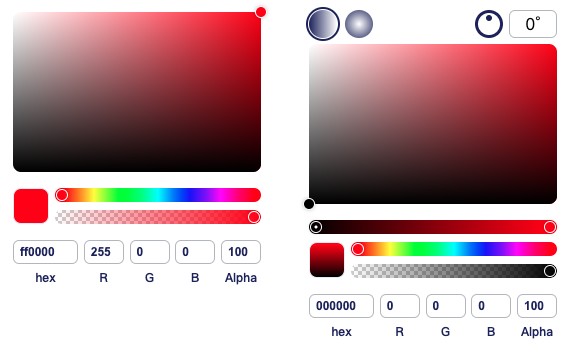

<!--
 * @Author: bamzc
 * @Date: 2023-08-16 10:02:22
 * @LastEditors: bamzc
 * @LastEditTime: 2024-01-22 14:50:39
 * @Description: 
-->
# vue3-color-gradient-picker

This template should help get you started developing with Vue 3 in Vite.

[](https://www.npmjs.com/package/vue3-color-gradient-picker)
[](https://www.npmjs.com/package/vue3-color-gradient-picker)

Color and gradient picker for vue3.js. [If you use vue2， plese use color-gradient-picker](https://github.com/arthay/vue-color-gradient-picker).vue3-color-gradient-picker is an upgraded version of `color-gradient-picker`

本项目仅仅是将Vue2相关api修改成Vue3 [如果想彻底的使用Vue3，请使用Qiu-Jun大佬的项目哈~ ](https://github.com/Qiu-Jun/color-gradient-picker-vue3).vue3-color-gradient-picker is an upgraded version of `color-gradient-picker`



#### Usage

```bash
yarn add vue3-color-gradient-picker
# or npm install vue3-color-gradient-picker or pnpm install vue3-color-gradient-picker
```


## Project Setup

```sh
npm install
```

### Compile and Hot-Reload for Development

```sh
npm run dev
```

### Compile and Minify for Production

```sh
npm run build
```

## Examples

Here is a simple examples of vue3-color-gradient-picker being used in an app:

### Color Picker
```vue
<template>
  <div id="app">
    <ColorPicker
      :color="color"
      :onStartChange="color => onChange(color, 'start')"
      :onChange="color => onChange(color, 'change')"
      :onEndChange="color => onChange(color, 'end')"
    />
  </div>
</template>

<script>
import { ColorPicker } from 'vue3-color-gradient-picker';

export default {
  name: 'App',

  components: {
    ColorPicker
  },

  data()  {
    return {
      color: {
        red: 255,
        green: 0,
        blue: 0,
        alpha: 1
      }
    }
  },   

  methods: {
    onChange(attrs, name) {
      this.color = { ...attrs };
    }
  }
}
</script>

<style src="vue3-color-gradient-picker/dist/index.css" lang="css" />
```

### Gradient Color Picker
```vue
<template>
  <div id="app">
    <ColorPicker
      :gradient="gradient"
      :isGradient="true"
      :onStartChange="color => onChange(color, 'start')"
      :onChange="color => onChange(color, 'change')"
      :onEndChange="color => onChange(color, 'end')"
    />
  </div>
</template>

<script>
import { ColorPicker } from 'vue3-color-gradient-picker';

export default {
  name: 'App',

  components: {
    ColorPicker
  },

  data()  {
    return {
      gradient: {
        type: 'linear',
        degree: 0,
        points: [
          {
            left: 0,
            red: 0,
            green: 0,
            blue: 0,
            alpha: 1
          },
          {
            left: 100,
            red: 255,
            green: 0,
            blue: 0,
            alpha: 1
          }
        ]      
      }
    }
  },   

  methods: {
    onChange(attrs, name) {
      console.log(name);
    }
  }
}
</script>

<style src="vue3-color-gradient-picker/dist/index.css" lang="css" />
```

### Lint with [ESLint](https://eslint.org/)

```sh
npm run lint
```
